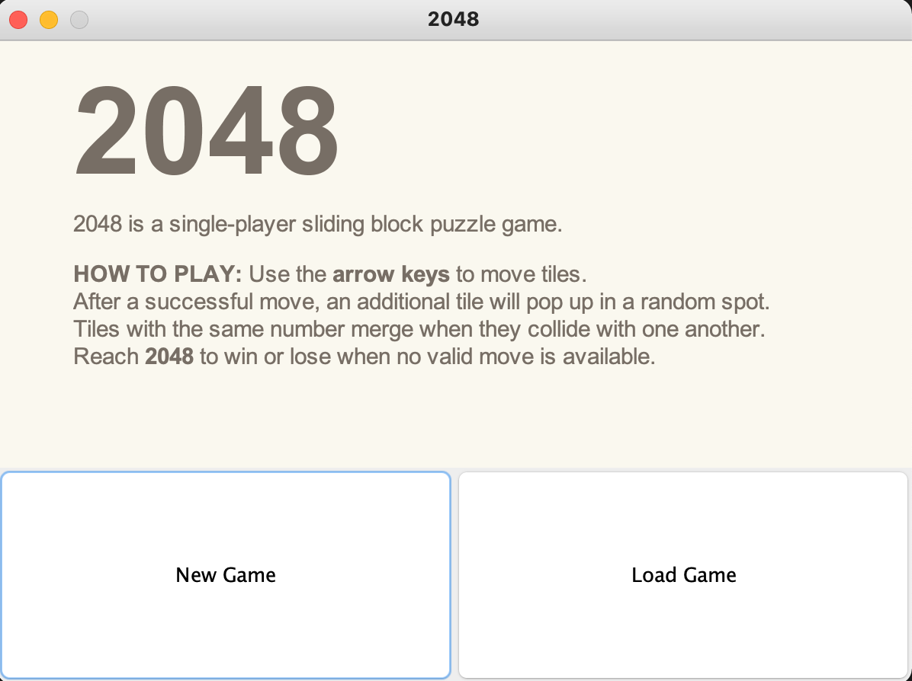
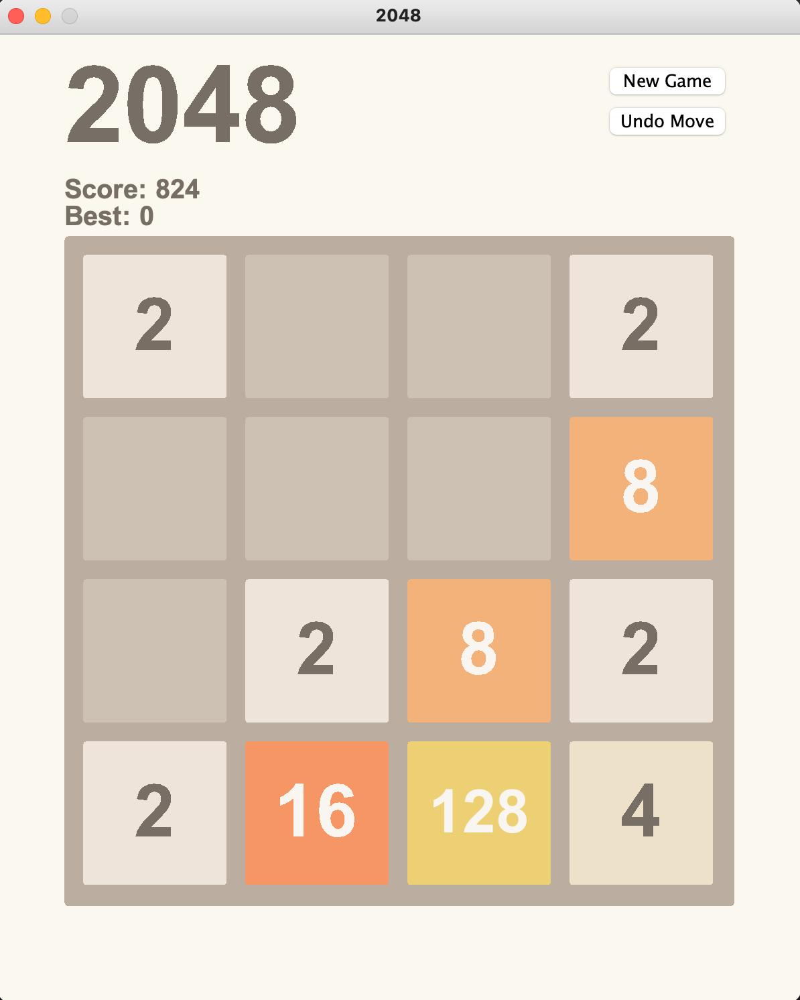

# 2048
I created <a href=https://play2048.co>2048</a>, a single-player sliding block puzzle game, for my CIS 120 Final Project.

### Start Menu


### Game Menu


## Directory Layout

```bash
.
├── src
│   ├── ControlPanel.java     # Create JPanel for showing game state (ex. score, best score) and  ability for user to undo move or create new game.
│   ├── Game.java             # Entry point of the program. create the start window and setup the game.
│   ├── GameBoard.java        # Acts as controller and view - JComponent on which the game is displayed. Handles user inputs like key pressed. Call GameLogic to perform moves and other things.
│   ├── GameLogic.java        # Model of the 2048 game. Implements all the main logics of the game (ex. merge tiles add tiles, write/read files). This is independent of the other class. 
│   ├── GameState.java        # Define enum types for representing the game state. Prevent user from doing certain things when the game is in a specific state.
│   └── StartPanel.java       # Create JPanel for the instructions part of the starting screen. 
└── test
    └── GameTest.java
```

## Running The Game

After compiling, run the following command inside the src folder

```bash
java Game
```
